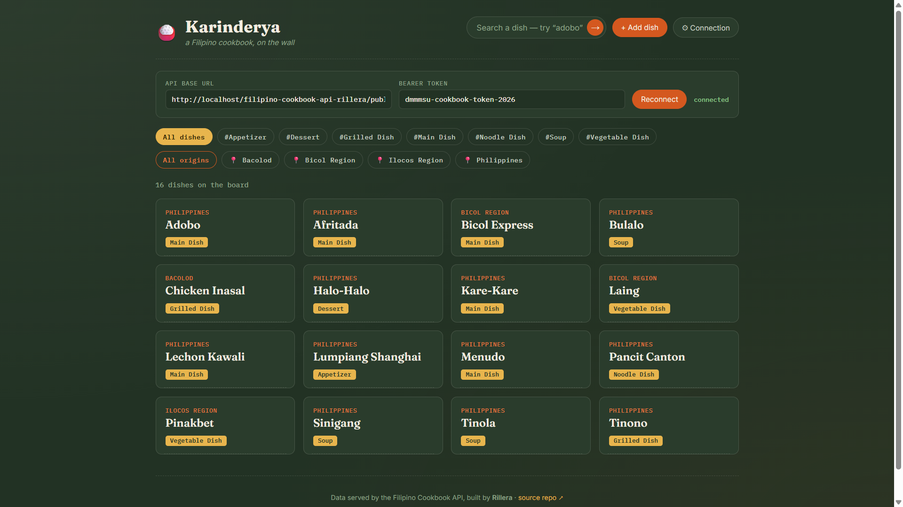
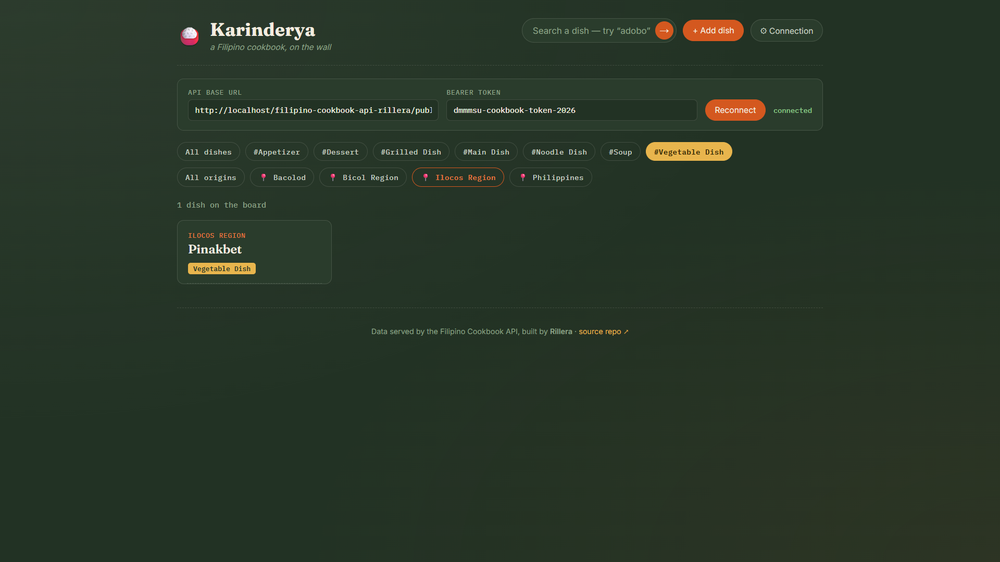
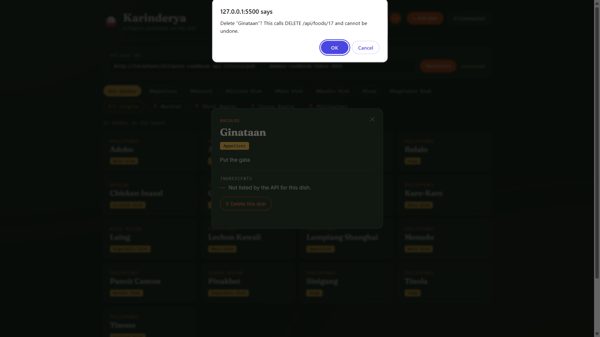
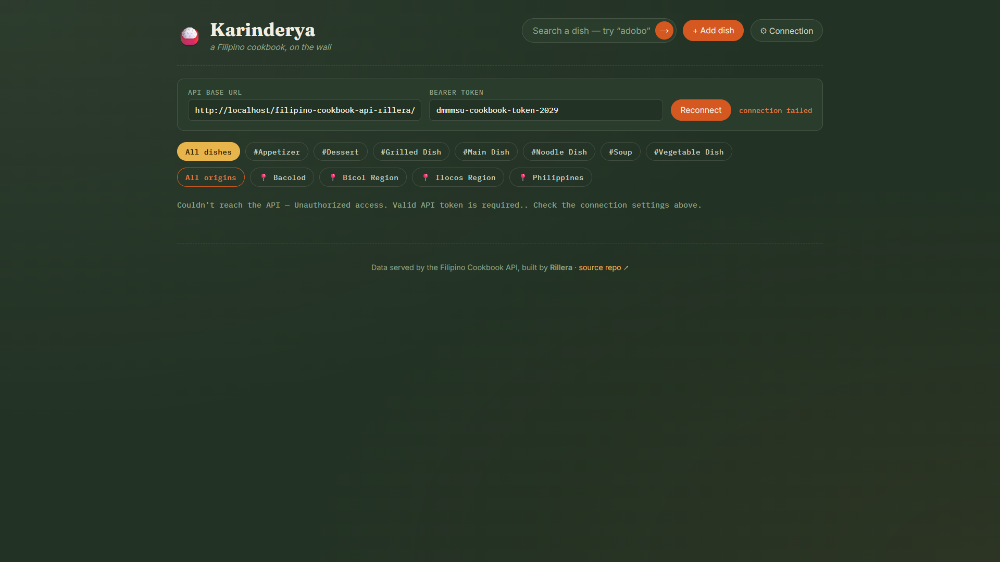

# Karinderya — Filipino Cookbook Client

A compact, single-page web client that consumes the **Filipino Cookbook API**
and displays dishes, categories, origins, and ingredients through a browsable
menu-board interface — including adding and deleting dishes directly against
the live API.

---

## Contents

1. [Application Description](#application-description)
2. [Technologies Used](#technologies-used)
3. [Installation Instructions](#installation-instructions)
4. [API Endpoints Used](#api-endpoints-used)
5. [Feature: Add & Delete Dishes](#feature-add--delete-dishes)
6. [Screenshots](#screenshots)
7. [Known Issues](#known-issues)
8. [API Source and Acknowledgment](#api-source-and-acknowledgment)

---

## Application Description

Karinderya is a lightweight front end for exploring Filipino dishes served by
a classmate's Filipino Cookbook API. It lets a user browse all dishes, filter
by category and origin, search by name, and open a dish to view its full
ingredient list — all through the API's JSON endpoints, with no direct
database access.

**API used:** [filipino-cookbook-api-rillera](https://github.com/exilleon/filipino-cookbook-api-rillera)
**Intended users:** students and reviewers testing the API's read endpoints
**Major features:** category/origin filtering, live search, dish detail view,
in-app API connection settings (base URL + token) so it can point at any
running instance of the API.

## Technologies Used

- HTML5, CSS3, vanilla JavaScript (Fetch API)
- Google Fonts (Fraunces, IBM Plex Mono, Inter)
- No build step, no framework — runs as static files

## Installation Instructions

1. Clone this repository:
   ```
   git clone https://github.com/YOUR_USERNAME/filipino-cookbook-client-surname.git
   cd filipino-cookbook-client-surname
   ```
2. Make sure the Filipino Cookbook API is running locally (see the
   [API repo](https://github.com/exilleon/filipino-cookbook-api-rillera) for
   its own installation steps: `composer install`, import the SQL file,
   start Apache/MySQL via XAMPP).
3. Open `index.html` in a browser (or serve the folder with any static
   server, e.g. `php -S localhost:8000`).
4. In the app, click **Connection** and confirm/edit:
   - **API base URL** — defaults to `http://localhost/filipino-cookbook-api-rillera/public/api`
   - **Bearer token** — defaults to `dmmmsu-cookbook-token-2026`
5. Click **Reconnect**. The menu board loads automatically on page open as well.

> Note: this API sends `Access-Control-Allow-Origin: *` on every response
> (verified in source), so no CORS setup is needed even if the client is
> served from a different port or origin than the API.

## API Endpoints Used

| Endpoint | Method | Used for |
|---|---|---|
| `/api/foods` | GET | Initial dish grid |
| `/api/categories` | GET | Category filter chips + Add Dish form dropdown |
| `/api/origins` | GET | Origin filter chips + Add Dish form dropdown |
| `/api/ingredients` | GET | Matching typed ingredient names to IDs for Add Dish |
| `/api/foods/search/{name}` | GET | Live search |
| `/api/foods/{id}` | GET | Dish detail drawer (ingredients) |
| `/api/foods` | POST | Add Dish form |
| `/api/foods/{id}` | DELETE | Delete button in the detail drawer |

All requests include `Authorization: Bearer <token>` and `Accept: application/json`.

**Response shape (verified against source, not just the API's README):** successful
responses return the raw array or object directly — there is no `{status, data}`
wrapper on success, only on errors (`{status: "error", message: "..."}`). Field
names on a food object are `food_id`, `food_name`, `category_name`, `origin_name`,
`instructions`, and `ingredients` (an array of ingredient name strings).

## Feature: Add & Delete Dishes

Two write operations were added on top of the original read-only browser:

**Add a dish** — click **+ Add dish** in the header. The form posts to
`POST /api/foods` with:
```json
{
  "food_name": "string, required",
  "category_id": "int, required — selected from a live dropdown of /api/categories",
  "origin_id": "int, required — selected from a live dropdown of /api/origins",
  "instructions": "string, required",
  "ingredient_ids": "array of int, optional — matched from comma-separated ingredient names against /api/ingredients"
}
```
On success (`201`), the board refreshes automatically. On failure (e.g. missing
required field, giving a `400`), the exact error message returned by the API is
shown inline in the form.

**Delete a dish** — open any dish's detail drawer and click **Delete this
dish**. This asks for confirmation, then calls `DELETE /api/foods/{id}`. On
success (`200`) the drawer closes and the board refreshes; on failure (e.g.
`404` if it was already deleted elsewhere) the error is shown inline.

Both actions require the bearer token set in the Connection panel, since the
API rejects unauthenticated writes the same way it does reads.

## Screenshots

- Main menu board with dishes loaded

- Category/origin filter in use

- Search results

- Dish detail drawer with ingredients

- **Add Dish** form filled out and submitted successfully

- A dish being deleted (confirmation + refreshed board)

- Connection error state (e.g. wrong token)


## Known Issues

- The current version of the upstream API (`filipino-cookbook-api-rillera`)
  registers a duplicate catch-all `OPTIONS` route in `public/index.php`
  (once near the CORS setup, once again near the bottom of the file), which
  causes a `FastRoute\BadRouteException` and crashes the entire app before
  it can respond to anything. This is not a bug in this client — it was
  reported to the API's developer. A local workaround (removing the second
  duplicate route registration) was used to test this client while waiting
  on the fix.

## API Source and Acknowledgment

This client application uses the **Filipino Cookbook API** developed by:

**Developer:** Stradlin Rillera
**GitHub Repository:** https://github.com/exilleon/filipino-cookbook-api-rillera

The API is used for educational purposes with the permission of the developer,
as part of a collaborative API development and integration activity.
